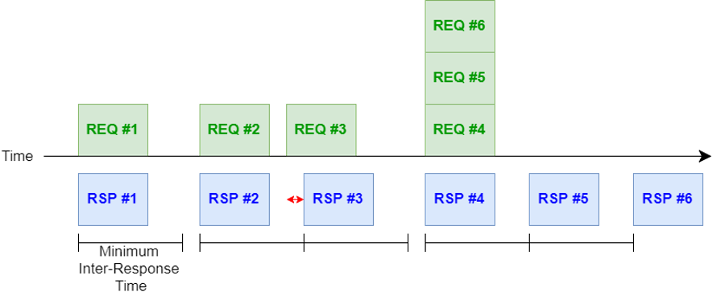

.. include:: replace.txt

+++++++++++++++++++++
PSC Application Model
+++++++++++++++++++++

The PSC application model provides a simple and flexible way to generate traffic for
various use cases using a client/server concept. Specifically, it uses a
Request-Response design where the client sends request messages to the server
that, if enabled, replies with response messages. 

-----------------
Model Description
-----------------

The client generates requests following an on-off model, where “on” periods are called sessions. Random
variables are associated with the inter-packet interval, number of packets in a
session, and the inter-session interval. 

.. _fig-psc-application-client:

   Client application model

On the server side, a response is generated as soon as a request arrives unless
the previous response was sent within the minimum inter-response time, in which
case it is delayed. The server application is thus configured using random
variables for the packet size and minimum inter-response time. 

.. _fig-psc-application-server:

   Server application model

The implementation is provided in the following files:

* ``src/psc/model/psc-application-configuration.{h.cc}`` The parameters used by the helper to configure the client and server applications. 
* ``src/psc/model/psc-application.{h.cc}`` Super class for the client and server implementation.
* ``src/psc/model/psc-application-client.{h.cc}`` The client application sending requests.
* ``src/psc/model/psc-application-server.{h.cc}`` The server application receiving requests and sending responses.

.. note:: The application is able to run over any transport protocol, e.g., UDP or TCP.

Additionally, a simple example is provided at ``src/psc/examples/example-psc-application.cc``.

Helpers
+++++++

One helper, ``ns3::psc::PscApplicationHelper``, has been created to facilitate
the configuration of the applications in both the client and the server.
Currently, the API includes a single function Install that takes as parameters
the application configure (i.e., name and traffic parameters), the client and
server nodes, server address, whether the server should send a response, and the
start and stop times of the application. During the install procedure, the
helper will configure the name of the application for each node by appending the
instance number and the extension "_Client" or "_Server" depending on the role
of the node. The helper uses an internal variable to the application
configuration object to determine the number of times the application has been
installed. This is convenient when the same application is deployed for several
pairs of nodes. The helper will also configure the random variables in each node
associated with the packet sizes, packet intervals, session duration, and time
between sessions. The install function will also set the start and stop times of
both the client and server, with the server starting 1 s before the client and
stopping 1 s after the client in order to limit situations where packets are
lost because the server is not ready. The helper returns an ApplicationContainer
containing first the client then the server.

.. note:: The helper currently only works with IPv6 networks.

Attributes
++++++++++

PscApplicationConfiguration
---------------------------

PscApplicationConfiguration exposes no attribute.

PscApplication
--------------

* ``AppName``: string representing the name of the application.
* ``Protocol``: TypeId of the protocol to be used (e.g., UDP).

PscApplicationClient
--------------------

* ``PacketSize``: Packet size (in bytes) for the requests sent by the client to the server.
* ``RemoteAddress``: Address of the server.
* ``RemotePort``: Port number of the server application.
* ``PacketsPerSession``: Random variable used to select the number of packets to transmit within a session.
* ``PacketInterval``: Random variable used to select the interval of time between two packets.
* ``SessionInterval``: Random variable used to generate the interval between sessions.

PscApplicationServer
--------------------

* ``Port``: Listening port to receive packets.
* ``PacketSize``: Size of the packets (in bytes) for the responses sent to the client.
* ``MinResponseInterval``: Minimum interval between consecutive response packets.
* ``IsSink``: Flag to indicate where the server is a sink (i.e., does not send responses to the client) or not.

Trace sources
+++++++++++++

PscApplication
--------------

* ``Tx``: General trace for packets transmitted by the application. Each trace includes the name of the application and the SeqTsSizeHeader, allowing tracking of the sequence number, time stamp, and packet size.
* ``Rx``: General trace for packets received by the application. Each trace includes the name of the application and the SeqTsSizeHeader, allowing tracking of the sequence number, time stamp, and packet size.
* ``Times``: General trace to provide the start and stop times of the application. Each trace includes the name of the application, the start time, and the stop time. The trace is called every time the application is started or stopped.

-----
Usage
-----

There is one example in the ``psc/example/example-psc-application.cc``.

In that example, two nodes, n0 and n1 are connected via a Carrier Sense Multiple Access (CSMA) link with a 100 Mb/s data rate and 1 ms delay. 
::

  //
  // n0 ==================  n1  
  //    LAN 6001:db80::/64

By running with the existing defaults, the program will configure n0 as the
client and n1 as the server. The client is configured with "on" session durations
of 10 s with 5 s between sessions. In each session, the client will send 10
requests of 50 Bytes at 1 s interval. For each request, the server will send a
response of 20 Bytes.

The configuration and deployment of the PscApplication instances is done in two steps:

* Creation and configuration of a PscApplicationConfiguration object as shown below:

::

  Ptr<PscApplicationConfiguration> appConfig = CreateObject <PscApplicationConfiguration> (
      "PscApplicationExample",
      UdpSocketFactory::GetTypeId (),     //Socket type
      5000                                //port number
      );

  appConfig->SetApplicationPattern (
    CreateObjectWithAttributes<ConstantRandomVariable> ("Constant", DoubleValue (10)),   //Number of packets to send per session
    CreateObjectWithAttributes<ConstantRandomVariable> ("Constant", DoubleValue (1)),   //Packet interval (in s)
    CreateObjectWithAttributes<ConstantRandomVariable> ("Constant", DoubleValue (5)),   //Time between sessions
    50,        //Client packet size (bytes)
    20);       //Server packet size (bytes)

* Deployment of the application in the client and server nodes, which can easily be done using an instance of PscApplicationHelper as show below:

::

  Ptr<PscApplicationHelper> appHelper = CreateObject<PscApplicationHelper> ();

  ApplicationContainer apps = appHelper->Install (appConfig, csmaNodes.Get (0),
                                csmaNodes.Get (1),
                                csmaNodes.Get (1)->GetObject<Ipv6L3Protocol> ()->GetAddress (1, 1).GetAddress (),
                                echoClient,
                                Seconds (startTime),
                                Seconds (simTime));

The example program supports a few options to change the application behavior
and the level of output. The list of arguments is listed by using the
‘—PrintHelp’ option shown below:

::

  $ ./ns3 --run 'example-psc-application --PrintHelp'

  Program Options:
    --echoClient:    Set EchoClient attribute [true]
    --verbose:       Tell echo applications to log if true [true]
    --enableTraces:  Enable trace file output [false]
    --time:          Simulation time [30]

The "echoClient" argument controls whether the server will send responses to the
client. The "verbose" argument enables debug information and requires the program
to be compile with ‘debug’ option. The "enableTraces" lets the program connect to
the application trace sources and store the packets transmitted and received by
both the client and the server applications. Finally, the "time" argument controls
the duration of the simulation.

By enabling the traces, the program will generate an output file called
PscApplicationExample_trace.txt with the packet information. If the "echoClient"
argument is set to "true" (default), the output will look like:

.. sourcecode:: text

  Name    Time    Action  Payload SeqNum
  PscApplicationExample_0_Client 2 TX 50 1
  PscApplicationExample_0_Server 2.00503 RX 50 1
  PscApplicationExample_0_Server 2.00503 TX 20 2
  PscApplicationExample_0_Client 2.00604 RX 20 2
  PscApplicationExample_0_Client 3 TX 50 3
  PscApplicationExample_0_Server 3.00101 RX 50 3
  PscApplicationExample_0_Server 3.00101 TX 20 4
  PscApplicationExample_0_Client 3.00202 RX 20 4
  PscApplicationExample_0_Client 4 TX 50 5
  PscApplicationExample_0_Server 4.00101 RX 50 5
  ...

If the "echoClient" argument is set to "false", the output will look like:

.. sourcecode:: text

  Name    Time    Action  Payload SeqNum
  PscApplicationExample_0_Client 2 TX 50 1
  PscApplicationExample_0_Server 2.00503 RX 50 1
  PscApplicationExample_0_Client 3 TX 50 2
  PscApplicationExample_0_Server 3.00101 RX 50 2
  PscApplicationExample_0_Client 4 TX 50 3
  PscApplicationExample_0_Server 4.00101 RX 50 3
  PscApplicationExample_0_Client 5 TX 50 4
  PscApplicationExample_0_Server 5.00101 RX 50 4
  PscApplicationExample_0_Client 6 TX 50 5
  PscApplicationExample_0_Server 6.00101 RX 50 5
  ...

