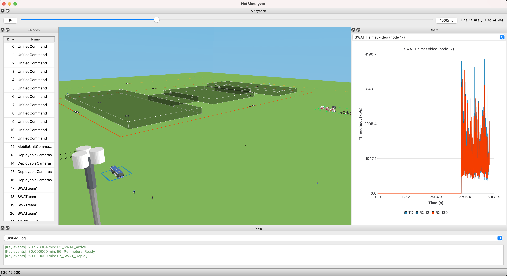

.. include:: replace.txt

+++++++++++++++++++++++++++
Incident Scenario Framework
+++++++++++++++++++++++++++

In [NIST2019b]_, guidelines were provided to help authors of scenarios
document incidents with enough detail to be reproducible by different
researchers using different platforms. In addition, the guidelines separated the
description of the incident and the communication needs (who, what, where) from
the technology (how), thus making it easier to investigate different network
capabilities for the same scenario. 

Similarly, the objective of the incident scenario framework presented in this
section is to provide a set of classes and a methodology for developing
potentially complex scenarios involving hundreds of users and a multitude of
applications. The modular approach helps the users evaluate different
technologies and configurations without having to start from scratch. 

---------------
Design Overview
---------------

The methodology for implementing scenarios involves the following steps:

#. Describe the scenario: define the area where the incident occurs, including the buildings if present, all the users and their mobility, and the timing of the main events.

#. Configure the network: configure technology specific devices in the nodes. For example, deploy an LTE network and attach NetDevices to the nodes.

#. Configure the applications: deploy applications in the nodes with appropriate start and stop time based on the scenario events. 

This methodology was used to implement the fictional school shooting scenario described in [NIST2021c]_ and whose implementation is located in ``psc/example/schoolshooting``.

To assist with the description of scenarios and provide consistent information,
a new class ``ns3::psc::PscScenarioDefinition`` was created to define and store
scenario information composed of: 

* Areas: an area is a zone of interest in the scenario. When an incident occurs, first responders typically define perimeters and areas where specific activities will take place (e.g., triage). Those areas are defined by a name and a rectangle.

* Structures: a structure represents a building at the location of the incident. A structure is defined by a name and a BuildingContainer to store one or more ns-3 buildings. 

* Node groups: a group of nodes associated with a given role. Typical response teams are organized by roles, e.g., SWAT teams or firefighters. A group of nodes is defined by the name of the group and a NodeContainer with one or more ns-3 nodes.

* Key events: an event is used to identify the time at which a significant event occurred during the scenario, e.g., an explosion or an arrest. Those events are usually followed by actions from the first responders. An event is defined by a name and the time at which it occurs.

* Applications: a list of applications used during the incident.

The ``ns3::psc::PscScenarioDefinition`` stores the information using different maps with a user-provided unique ID as the key. 

The implementation is provided in the following file:

* ``src/psc/model/psc-scenario-definition.{h.cc}``.

Helpers
+++++++

The ``ns3::psc::PscScenarioTraceHelper`` class defined by the files
``src/psc/helper/psc-scenario-definition.{h.cc}`` can be used to provide
consistent output traces for any incident scenario. The traces are generated at
the time they are enabled, therefore the user must define the scenario
completely before attaching the helper otherwise some information may not be
included in the trace files.

The name of the trace files is based on the scenario name and append a suffix
based on the type of trace and the file extension ".txt". 

The trace file for the areas has a name that ends with the suffix "-areas.txt" and
has the following format:

.. sourcecode:: text

  ID  Name  xMin  xMax  yMin  yMax

where xMin, xMax, yMin, and yMax define the boundaries of the area.

The trace file for the structures has a name that ends with the suffix "-structures.txt" and has the following format:

.. sourcecode:: text

  ID  Name  xMin  xMax  yMin  yMax  zMin  zMax

where xMin, xMax, yMin, yMax, zMin, and zMax define the 3D boundaries of the structure (i.e., ns-3 building).

The trace file for the nodes has a name that ends with the suffix "-nodes.txt" and has the following format:

.. sourcecode:: text

  GroupID GroupName UID X Y Z

where UID is ns-3 generated node ID, and X, Y, and Z are the initial coordinates for the node.

The trace file for the events has a name that ends with the suffix "-events.txt" and has the following format:

.. sourcecode:: text

  ID  Name  Time

where Time is the time of the event.

Additionally, the helper can be used to trace the progress of the simulation by
calling the 'EnableTimeTrace' method and providing an ``ns3::Time`` argument
that specifies the time interval between updates. The simulation time is then printed into
a file with the suffix "-time.txt".

Attributes
++++++++++

The class ``PscScenarioDefinition`` does not expose any attribute.

Trace sources
+++++++++++++

The class ``PscScenarioDefinition`` does not expose any trace source.

------------------------
Example: School shooting
------------------------

The example available in the ``psc/example/schoolshooting`` folder is a large
scale school shooting incident involving over 100 first responders and vehicles,
more than a dozen different types of applications, and that is over four hours
in simulation time.

The implementation of the example is provided in the following files:

* ``src/psc/examples/schoolshooting/psc-schoolshooting.cc`` The main program to launch the example. 
* ``src/psc/examples/schoolshooting/schoolshooting-definition-helper.{h.cc}`` Helper class to define the scenario. 
* ``src/psc/examples/schoolshooting/schoolshooting-network-technology-helper.{h.cc}`` Abstract helper class that defines the API for the underlying technology helper. 
* ``src/psc/examples/schoolshooting/schoolshooting-lte-helper.{h.cc}`` Helper class for deploying the LTE network supporting the incident that implements the underlying technology API. 
* ``src/psc/examples/schoolshooting/schoolshooting-application-helper.{h.cc}`` Helper class to define and deploy the applications. 
* ``src/psc/examples/schoolshooting/schoolshooting-application-trace-helper.{h.cc}`` Helper class to activate application traces. 
* ``src/psc/examples/schoolshooting/schoolshooting-lte-vis-helper.{h.cc}`` Helper class to visualize the incident using NetSimulyzer [NIST2021b]_. 

Helpers
+++++++

SchoolShootingDefinitionHelper
------------------------------

The ``SchoolShootingDefinitionHelper`` helper is responsible for defining the
school shooting scenario description. All the areas, buildings, nodes, and
events are defined in this class. The helper also defines the mobility models of
each node throughout the duration of the incident. 

SchoolShootingNetworkTechnologyHelper
-------------------------------------

The ``SchoolShootingNetworkTechnologyHelper`` helper is meant to provide an API
for technology specific deployment helpers. It provides virtual functions to
access nodes specified in the scenario that may be implemented differently based
on the technology used. 

SchoolShootingLteHelper
-----------------------

The ``SchoolShootingLteHelper`` helper is a subclass of
``SchoolShootingNetworkTechnologyHelper`` and is responsible for deploying an
LTE network and associated devices in order to provide first responders with a
means of communication. 

SchoolShootingApplicationHelper
-------------------------------

The ``SchoolShootingApplicationHelper`` helper is the interface towards the
applications. It is responsible for deploying all the applications inside the
nodes. It manages the ports to be used by each application. Getter functions are
also available to access the installed applications during simulation. Finally,
the helper API also allows the user to enable traces for the various applications.

SchoolShootingApplicationTraceHelper
------------------------------------

The ``SchoolShootingApplicationHelper`` helper is responsible for creating trace
files associated with the various applications. When an application trace is
enabled, the helper will connect to the model's trace sources and register
callback functions to write traces to files. Because the scenario uses different
types of applications, the helper functions are specific to each application model. 

SchoolShootingLteVisHelper
---------------------------

The ``SchoolShootingLteVisHelper`` helper is an optional helper that generates a
JSON file to replay and visualize the incident with NetSimulyzer [NIST2021b]_. It
connects to the scenario definition to obtain building and node information
(including positions throughout the simulation), to the technology helper to
obtain network information (e.g., eNodeB height), and to the application helper
to connect to the applications' trace sources. 

Attributes
++++++++++

SchoolShootingDefinitionHelper
------------------------------

* ``CreateClassrooms``: boolean to enable the creation of ns-3 buildings representing the classrooms inside the main buildings. Due to limitations in the ns-3 propagation models with buildings inside other buildings, it should not be used when a technology is enabled. For example, this feature can be enabled with the scenario is ran with the NetSimulyzer traces enabled and the LTE disabled.

SchoolShootingNetworkTechnologyHelper
-------------------------------------

The class ``SchoolShootingNetworkTechnologyHelper`` does not expose any attribute.

SchoolShootingLteHelper
-----------------------

* ``PathLossModelType``: the path loss model to use. The default is ``ns3::Hybrid3gppPropagationLossModel``.
* ``SchedulerType``: the MAC scheduler. The default is ``ns3::RrFfMacScheduler``.
* ``DlBandwidth``: the number of RBs in the downlink. The default is 50 RBs.
* ``UlBandwidth``: the number of RBs in the uplink. The default is 50 RBs.
* ``DlEarfcn``: the Downlink E-UTRA Absolute Radio Frequency Channel Number (EARFCN) as per 3GPP 36.101. The default is 5330 (LTE Band 14).
* ``UlEarfcn``: the Uplink E-UTRA Absolute Radio Frequency Channel Number (EARFCN) as per 3GPP 36.101. The default is 23 330 (LTE Band 14).
* ``UeAntennaHeight``: the height of the UEs. The default is 1.5 m.
* ``EnbAntennaHeight``: the height of the eNodeBs. The default is 30 m.
* ``UeTransmissionPower``: the UE transmit power. The default is 23 dBm.
* ``EnbTransmissionPower``: the eNodeB transmit power. The default is 46 dBm.
* ``DefaultTransmissionMode``: the eNodeB transmission mode. The default is 2 (MIMO spatial multiplexing).
* ``LinkDataRate``: the rate for the links between network elements. The default is 10 Gb/s.
* ``LinkDelay``: the delay for the links between network elements. The default is 10 ms.

SchoolShootingApplicationHelper
-------------------------------

* ``Testing``: boolean to enable/disable the testing mode of the applications. If enabled, applications are configured with condensed parameters and start/stop times below 100 s.

SchoolShootingApplicationTraceHelper
------------------------------------

The class ``SchoolShootingApplicationTraceHelper`` does not expose any attribute.

SchoolShootingLteVisHelper
---------------------------

* ``Interval``: time interval between node mobility updates. Smaller values increase the size of the output file.

Trace sources
+++++++++++++

None of the helper classes exposes trace sources. However, the helpers
``SchoolShootingApplicationHelper`` and ``SchoolShootingLteVisHelper`` connect
to many different trace sources exposed by the technology and application models.

Usage
+++++

The main program located in
``src/psc/examples/schoolshooting/psc-schoolshooting.cc`` is responsible for
assembling the various components of the simulation. Thanks to the use of helper
classes, the code is relatively simple.

The following code block shows the minimum setup to create a simulation based on the school shooting scenario:

.. sourcecode:: cpp

   //1. Create the scenario
   Ptr<SchoolShootingDefinitionHelper> scenarioDefinitionHelper = CreateObject<SchoolShootingDefinitionHelper> ();

   //2. Create technology helper and initialize the network
   Ptr<SchoolShootingLteHelper> lteScenarioHelper = CreateObject<SchoolShootingLteHelper> ();
   lteScenarioHelper->SetScenarioDefinitionHelper (scenarioDefinitionHelper);
   lteScenarioHelper->Initialize ();

   //3. Create the application helper and 
   Ptr<SchoolShootingApplicationHelper> scenarioApplicationHelper = CreateObject<SchoolShootingApplicationHelper> ();
   scenarioApplicationHelper->SetTechnologyHelper (lteScenarioHelper);
   scenarioApplicationHelper->SetScenarioDefinitionHelper (scenarioDefinitionHelper);

   //4. Enable traces
   Ptr<PscScenarioTraceHelper> scenarioTraceHelper = CreateObject<PscScenarioTraceHelper> (scenarioDefinitionHelper->GetScenarioDefinition ());
   scenarioTraceHelper->EnableScenarioTraces ();
   scenarioApplicationHelper->EnableApplicationTraces ();
   lteScenarioHelper->EnableLteTraces ();
 
However, for convenience, the example program supports a few options to change
the application behavior and the trace selection. The list of arguments is
listed by using the‘—PrintHelp’ option shown below:

::

  $ ./ns3 run 'psc-schoolshooting --PrintHelp'

  Program Options:
    --duration:         Duration (in Seconds) of the simulation [+4.0833h]
    --enableLte:        Flag to enable LTE deployment [true]
    --enableLteTraces:  Flag to enable LTE traces [true]
    --enableGuiTraces:  Flag to enable the visualization traces [false]
    --guiResolution:    Granularity of the visualization [1000]
    --reportTime:       Indicates whether or not the simulation time is reported periodically [+1s]
    --testing:          Indicates if using modified application times for 100 s simulation [false]
    --appId:            The ID for the application (see schoolshooting-application-helper.h::SchoolSchootingApplicationId [-1]

The "duration" argument allows the user to control the duration of the
simulation, but there is no traffic after the incident ends at 14700 s (245
min). The "enableLte" argument determines if the LTE technology is enabled. If
disabled, buildings and nodes are still created, but applications cannot run.
Disabling it is useful to verify node mobility as the simulation speed
drastically improves. If LTE is enabled, application traces are also enabled.
The name of the scenario is also based on whether or not LTE is enabled. If LTE
is disabled, the scenario name is "SchoolShootingNoLte", and if it is enabled,
the name is "SchoolShootingLte", thus avoiding overwritting output files. The
"enableLteTraces" controls the generation of the standard LTE traces, some of
which are very large due to the simulation length. The "enableGuiTraces" and
"guiResolution" enables the generation of a trace file for NetSimulyzer and the
frequency of updates, respectively. Note that if NetSimulyzer is not part of the
ns-3 installation, enabling the traces will be ignored. The "reportTime"
argument sets the periodicity of the time trace that prints the current
simulation time. This is useful to monitor the progress of the simulation which
can be a couple of days depending on the machine on which the simulation is
running. The "testing" argument can be used to toggle a modified version of the
scenario in which applications parameters are condensed and the simulation is
set to 100 s. As the name indicates, this was used for testing the scenario and
detecting potential issues without running the full simulation. Finally, the
"appId" argument can be used to run the simulation by enabling a single type of
application as defined in the enumeration
``SchoolShootingApplicationHelper::SchoolSchootingApplicationId``. This was used
to validate the application configuration. Note that the behavior observed with
a single application enabled does not necessarily reflect the behavior that will
be observed when all the applications are enabled due to the possibility of
congestion and packet loss. 

In addition to the parameters exposed as command-line arguments, ns-3 allows the
configuration of the default value of any class attribute through the
command-line interface, and allows available classes and attributes to be
printed out.  See the `ns-3 tutorial
<https://www.nsnam.org/docs/release/3.34/tutorial/html/tweaking.html#using-command-line-arguments>`_
for more information about this.

A number of output files are generated based on the traces enabled. In addition
to scenario files, application-specific traces are also generated. The number
and format of the traces is dependent on the model being used. By default the
following files will be created:

* Scenario information: 

   * ``SchoolShootingLte-structures.txt``: list of buildings and their locations.
   * ``SchoolShootingLte-areas.txt``: list of areas and their boundaries.
   * ``SchoolShootingLte-nodes.txt``: list of nodes including their group name and initial location.
   * ``SchoolShootingLte-events.txt``: list of events and the time they occur.
   * ``SchoolShootingLte-time.txt``: file tracking the simulation time.

* Application statistics:

   * ``SchoolShootingLte-AutomaticVehicleLocation-appTraffic.txt``: trace of packets sent and received by the instances of the vehicle location tracking application. Generated by the ``PscApplication`` model.
   * ``SchoolShootingLte-AutomaticVehicleLocation-appTimes.txt``: trace of start and stop times of the instances of the vehicle location tracking application. Generated by the ``PscApplication`` model.
   * ``SchoolShootingLte-Biometrics-appTraffic.txt``: trace of packets sent and received by the instances of the biometrics application. Generated by the ``PscApplication`` model.
   * ``SchoolShootingLte-Biometrics-appTimes.txt``: trace of start and stop times of the instances of the biometrics application. Generated by the ``PscApplication`` model.
   * ``SchoolShootingLte-BuildingPlan-appTraffic.txt``: trace of packets sent and received by the instances of the building plans data application. Generated by the ``PscApplication`` model.
   * ``SchoolShootingLte-BuildingPlan-appTimes.txt``: trace of start and stop times of the instances of the building plans data application. Generated by the ``PscApplication`` model.
   * ``SchoolShootingLte-DeployableCameraVideo-appTraffic.txt``: trace of packets sent and received by the instances of the deployable camera. Generated by the ``PscVideoStreaming`` model.
   * ``SchoolShootingLte-EmsVehicleCameraVideo-appTraffic.txt``: trace of packets sent and received by the instances of the EMS vehicle camera. Generated by the ``PscVideoStreaming`` model.
   * ``SchoolShootingLte-HelicopterCameraVideo-appTraffic.txt``: trace of packets sent and received by the instances of the helicopter camera. Generated by the ``PscVideoStreaming`` model.
   * ``SchoolShootingLte-IncidentManagement-appTraffic.txt``: trace of packets sent and received by the instances of the incident management application. Generated by the ``PscApplication`` model.
   * ``SchoolShootingLte-IncidentManagement-appTimes.txt``: trace of start and stop times of the instances of the incident management application. Generated by the ``PscApplication`` model.
   * ``SchoolShootingLte-NG911Video-appTraffic.txt``: trace of packets sent and received by the instances of the NG911 videos. Generated by the ``PscVideoStreaming`` model.
   * ``SchoolShootingLte-RmsBca-appTraffic.txt``: trace of packets sent and received by the instances of the Records Management System (RMS) and Bureau of Criminal Apprehension (BCA) database application. Generated by the ``PscApplication`` model.
   * ``SchoolShootingLte-RmsBca-appTimes.txt``: trace of start and stop times of the instances of the RMS and BCA database application. Generated by the ``PscApplication`` model.
   * ``SchoolShootingLte-Satellite-appTraffic.txt``: trace of packets sent and received by the instances of the satellite images application. Generated by the ``PscApplication`` model.
   * ``SchoolShootingLte-Satellite-appTimes.txt``: trace of start and stop times of the instances of the satellite images application. Generated by the ``PscApplication`` model.
   * ``SchoolShootingLte-SchoolCameraVideo-appTraffic.txt``: trace of packets sent and received by the instances of the school camera. Generated by the ``PscVideoStreaming`` model.
   * ``SchoolShootingLte-SwatHelmetCameraVideo-appTraffic.txt``: trace of packets sent and received by the instances of the helmet cameras. Generated by the ``PscVideoStreaming`` model.
   * ``SchoolShootingLte-TacticalTelemetry-appTraffic.txt``: trace of packets sent and received by the instances of the tactical telemetry application. Generated by the ``PscApplication`` model.
   * ``SchoolShootingLte-TacticalTelemetry-appTimes.txt``: trace of start and stop times of the instances of the tactical telemetry application. Generated by the ``PscApplication`` model.
   * ``SchoolShootingLte-ThrowPhone-appTraffic.txt``: trace of packets sent and received by the instances of the throw phone voice application. Generated by the ``PscApplication`` model.
   * ``SchoolShootingLte-ThrowPhone-appTimes.txt``: trace of start and stop times of the instances of the throw phone voice application. Generated by the ``PscApplication`` model.
   * ``SchoolShootingLte-ThrowPhoneCameraVideo-appTraffic.txt``: trace of packets sent and received by the instances of the throw phone camera. Generated by the ``PscVideoStreaming`` model.
   * ``SchoolShootingLte-TrafficCameraVideo-appTraffic.txt``: trace of packets sent and received by the instances of the traffic camera. Generated by the ``PscVideoStreaming`` model.
   * ``SchoolShootingLte-VideoConference-appTraffic.txt``: trace of packets sent and received by the instances of the audio conference application. Generated by the ``PscApplication`` model.
   * ``SchoolShootingLte-VideoConference-appTimes.txt``: trace of start and stop times of the instances of the audio conference application. Generated by the ``PscApplication`` model.
   * ``SchoolShootingLte-VideoConferenceVideo-appTraffic.txt``: trace of packets sent and received by the instances of the video conference application. Generated by the ``PscVideoStreaming`` model.
   * ``SchoolShootingLte-Web-appTraffic.txt``: trace of packets sent and received by the instances of the web application. Generated by the ``IntelHttp`` model.
   * ``mcptt-m2e-latency.txt``: MCPTT related trace containing mouth-to-ear latency. Generated by the ``MCPTT`` application model.
   * ``mcptt-access-time.txt``: MCPTT related trace containing access time performance. Generated by the ``MCPTT`` application model.

* LTE traces
   Additionally, there are 13 LTE trace files to monitor the uplink and downlink transmissions at the physical layers all the way to the PDCP layers. The format of the files is described in the LTE section of the ns-3 model documentation.

If the NetSimulyzer traces are enabled, the following file is also generated:

* ``SchoolShootingLte.json``: file containing visualization information for NetSimulyzer. Once loaded, the user can visualize the topology, replay the simulation, and analyze the network performance. A screenshot of the scenario loaded in NetSimulyzer is shown below.

.. _fig-psc-schoolshooting:

   Screenshot of school shooting scenario in NetSimulyzer

Extending the scenario
++++++++++++++++++++++

Even though several attributes have been exposed to change the network
parameters, the physical deployment remains the same. Using the proposed design,
researchers interested in evaluating different technologies (e.g., NR) or
variations of the sample LTE deployment can simply extend the class
``ns3::psc::SchoolSchootingNetworkTechnologyHelper``. For visualization, only a
small portion of the ``SchoolShootingLteVisHelper`` is actually technology
dependent (e.g., accessing the eNodeBs), therefore the helper can easily be
reused.