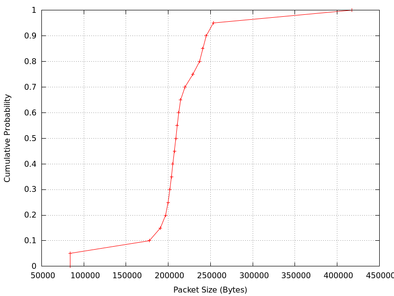

.. include:: replace.txt

+++++++++++++++++++++
Video Streaming Model
+++++++++++++++++++++

The class ``ns3::psc::PscVideoStreaming`` implements the model of a live video
streaming application over UDP. The class
``ns3::psc::PscVideoStreamingDistributions`` provides the data distributions
for some examples of video streaming with specific parameters.

-----------------
Model Description
-----------------

The implementation is provided in the following files:

* ``src/psc/model/psc-video-streaming.{h,cc}`` The video streaming application
* ``src/psc/model/psc-video-streaming-distributions.{h,cc}`` Data
  distributions for sample video streams

An example may be found in: ``src/psc/examples/example-video-streaming.cc``.

The video streaming application is modeled using statistical approach, in which
the traffic generated by the streaming application is characterized by two
independent variables that represent the size of the generated packets, and the
interval between said packets. These functions are characterized by the
Cumulative Distribution Function (CDF) that captures the distribution of values
for a given type of video stream. Therefore, a video stream can be defined by
just the two CDFs representing the packet size and inter-packet interval. This
simple representation makes it easy to extend if needed the data
distributions provided as examples.

Different types of video streams will be modeled through different
CDFs, so it is important to understand the characteristics of the video stream
being modeled in order to assess if any of the provided sample CDFs are a good
match for a specific scenario. Some of the aspects that may affect the data
distribution are, for example, the video codec used, video resolution, frame
rate, brightness of the scene, and amount of movement in the scene.

If new data distributions are needed, the model implementation makes it easy
to load the data files from text files, enabling the simulation of videos with
characteristics different of those provided by the default distributions.

Additionally, while the model is designed to only work with data distributions
of videos with the same characteristics, it is easy to model complex streams
with multiple scenes or changing streaming parameters by updating the data
distributions used by the model dynamically while a simulation is running. By
doing this, it is possible to model complex behaviors by capturing the data
distributions of simple video streams, and then combining these simple pieces
to build complicated and dynamic behaviors.

The model loads the raw data of the CDFs into two maps: ``m_sizeDistribution``
for the distribution of the packet size, and ``m_intervalDistribution`` for
the inter-packet interval. If we use one of the provided sample distributions
in ``src/psc/model/psc-video-streaming-distributions.{h,cc}`` we can load the
values by using the attribute ``Distribution`` with one of the following labels:

* "1080p-bright" for H.264 encoded videos at 1920x1080, 60 frames per second,  
  Constant Rate Factor 15, and bright scenes
* "1080p-dark" for H.264 encoded videos at 1920x1080, 60 frames per second,  
  Constant Rate Factor 15, and dark scenes
* "720p-bright" for H.264 encoded videos at 1280x720, 30 frames per second,  
  Constant Rate Factor 25, and bright scenes
* "720p-dark" for H.264 encoded videos at 1280x720, 30 frames per second,  
  Constant Rate Factor 25, and dark scenes

If we want to load our own data distribution, we can do so by calling
``ReadCustomDistribution`` with the paths to the text files with the CDF for
packet size and inter-packet interval as arguments. These files expected to have
the following specific format:

* The first line will specify the fixed interval between the probabilities in
  the CDF.
* The next lines will only contain the values for the probabilities in ascending
  order, starting at 0 and increasing by the increment read in the first line, up
  to 1.

The fixed probability increment is a way of ensuring that the CDF size is kept to
a reasonable size, as these distributions tend to have long tails that would
increase the amount of entries (and therefore, memory and processor cycles used
during the simulation) without actual significance for the size or interval.

An example of a custom CDF file for packet size is as follows:

.. sourcecode:: text

  0.05
  83719
  83725
  177583
  190703
  196828
  199767
  201894
  203689
  205419
  207177
  208978
  210626
  212399
  214640
  219810
  229150
  237063
  240963
  244952
  253338
  417404

This data file corresponds the distribution shown in Figure :ref:`fig-sample-video-cdf`:

.. _fig-sample-video-cdf:

   Plot of the sample CDF

Once the data distributions have been loaded into the maps, the method
``LoadCdfs`` creates internal random variables of type
``ns3::EmpiricalRandomVariable`` for each of the distributions. This method is
called by the ``StartApplication`` method, but it can be invoked by other
classes to reload the data distributions.

Once the simulation starts, the model will generate a random packet size from
the ``EmpiricalRandomVariable`` (which internally uses a uniform random number
to generate a probability, and linear interpolation between the two closest
provided values to compute the value associated with the probability generated).
If the packet exceeds the size indicated in the attribute ``MaxUdpPayloadSize``
the packet will be fragmented. Once all the fragments have been sent to the UDP
socket, the application waits an interval generated by the inter-packet interval
``EmpiricalRandomVariable`` before sending another packet.

One final feature of the models is that it is possible to configure a period of
time at the beginning of the application run (called "Boost Time" in the code)
in which the demand of the model is increased. This behavior mimics some
streaming applications sending high amounts of data in the first seconds of the
stream in order to build a buffer in the client that will provide some protection
against unexpected variation of the delay. In the model this is done by only
choosing packet sizes of a selected top percentile, and inter-packet intervals
of the same bottom percentile (therefore, choosing only between the largest
packet sizes with the smallest inter-packet intervals, thus boosting the
demand). Once a specified number of packets has been sent with this boosted
demand, the complete distributions are used for both packet size and inter-packet
interval. To configure this "Boost" period the model provides two attributes:

* ``BoostLengthPacketCount`` Length of the boosted demand, in packets.
* ``BoostPercentile`` Top (or bottom) percentile (from 0 to 100) to choose packet
  sizes and intervals from during the "Boost Time".

Limitations
+++++++++++

Currently, custom CDFs must be defined with fixed probability steps. The model
can be easily updated to overcome this limitation by interested users.

Changing the data distributions takes effect immediately, which may cause an
abrupt change in the application demand, instead of an expected smooth
transition.

Attributes
++++++++++

PscVideoStreaming
-----------------
* ``Distribution``:
    Label in ``ns3::psc::PscVideoStreamingDistributions`` that selects 
    the data distribution to be used by the model
* ``ReceiverAddress``:
    Address of the node receiving the data packets
* ``ReceiverPort``:
    UDP port of the application receiving the data packets
* ``BoostLengthPacketCount``:
    Length of the Boost Time expressed as number of packets sent. Set to 0 to
    indicate no Boost Time is desired.
* ``BoostPercentile``:
    CDF Percentile, between 0 and 100, from which to draw packet sizes and
    inter-packet intervals during Boost Time. A BoostPercentile of 90 means
    that for the duration of Boost Time, packet sizes will be selected from
    the 10 % largest values, while inter-packet intervals will be selected
    from the 10 % smallest values.
* ``MaxUdpPayloadSize``:
    Maximum payload size for the UDP packets transmitted. If a packet larger
    than this attribute is generated, it will be fragmented in pieces with,
    at most, this payload.

Trace Sources
+++++++++++++

PscVideoStreaming
-----------------
* ``Tx``:
    General trace for sending an application packet of any kind. This trace
    source is invoked for all packets passed to the Socket. Therefore, if a
    packet is fragmented, this trace source will be invoked once for each
    fragment.

-----
Usage
-----

A simple usage example is provided in 
``src/psc/examples/example-video-streaming.cc``.

The data distribution to be used can be loaded from one of the provided
distributions throught the ``Distribution`` Attribute:

.. sourcecode:: cpp

  Ptr <PscVideoStreaming> streamingServer = CreateObject <PscVideoStreaming> ();
  streamingServer->SetAttribute ("Distribution", StringValue ("1080p-bright"));

Alternatively, the distribution data can be loaded from text files (one for the
size distribution, one for the inter-packet interval distribution):

.. sourcecode:: cpp

  Ptr <PscVideoStreaming> streamingServer = CreateObject <PscVideoStreaming> ();
  streamingServer->ReadCustomDistribution (sizeFilePath, intervalFilePath);

Once the application starts, the data that was loaded will be used to create
some ``EmpiricalRandomVariables`` for use in the ``Send`` method. To change the
data distribution used (for example, to model the change from a bright scene
into a dark scene), we will update the data distribution using one of the
methods described above, and then we will invoke the ``LoadCdfs`` method to
signal that the new data should be used:

.. sourcecode:: cpp

  Ptr <PscVideoStreaming> streamingServer = CreateObject <PscVideoStreaming> ();
  ...
  streamingServer->ReadCustomDistribution (sizeFilePath, intervalFilePath);
  streamingServer->LoadCdfs ();

